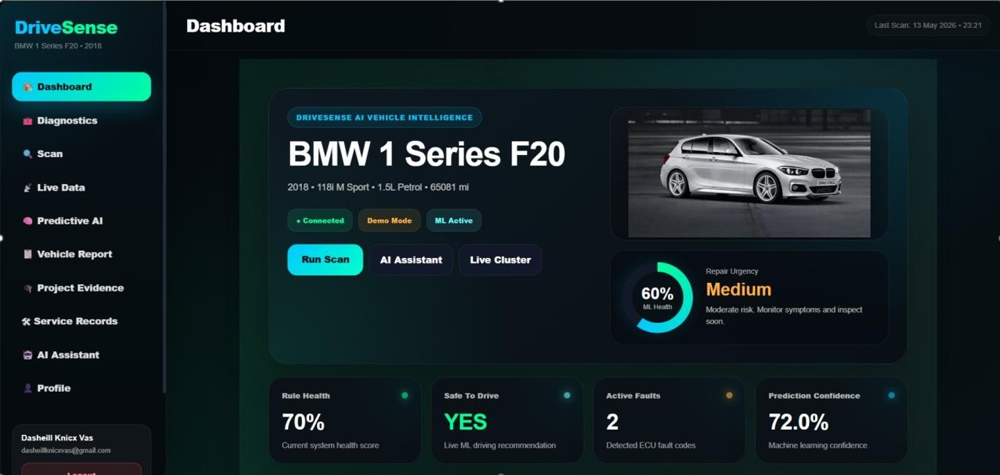
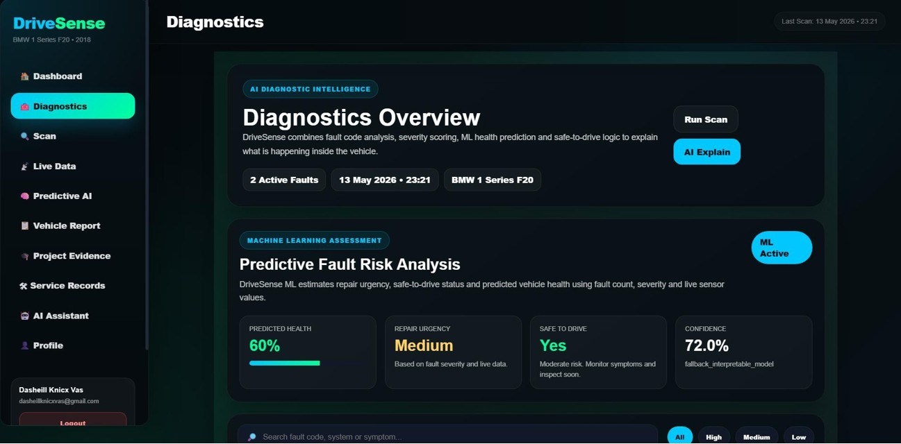
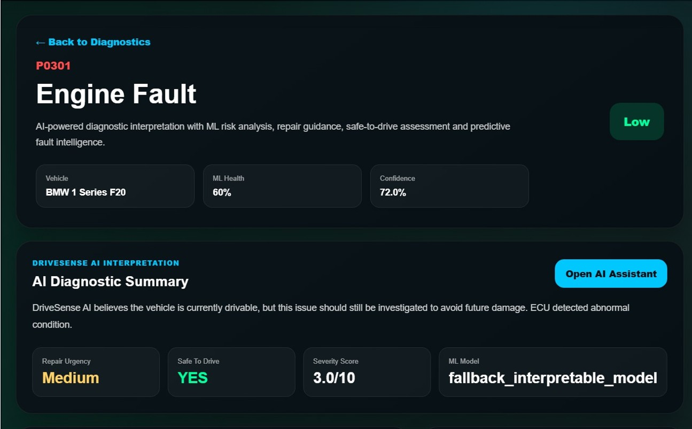
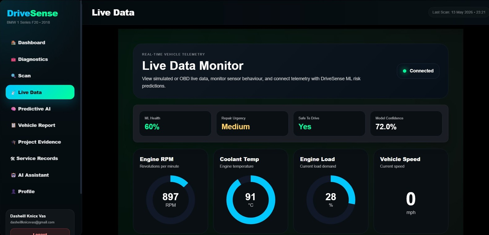
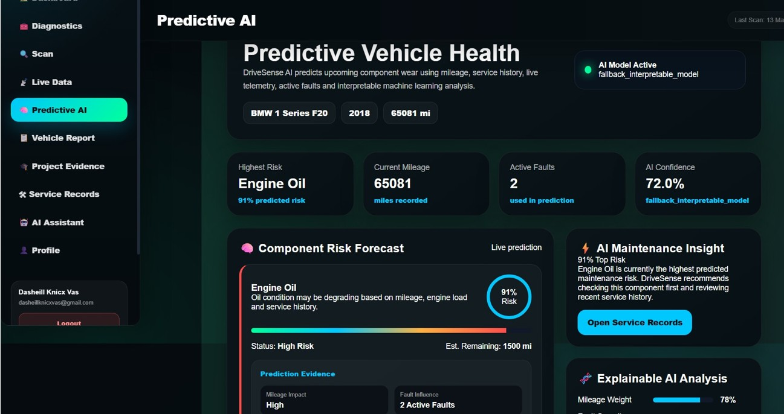
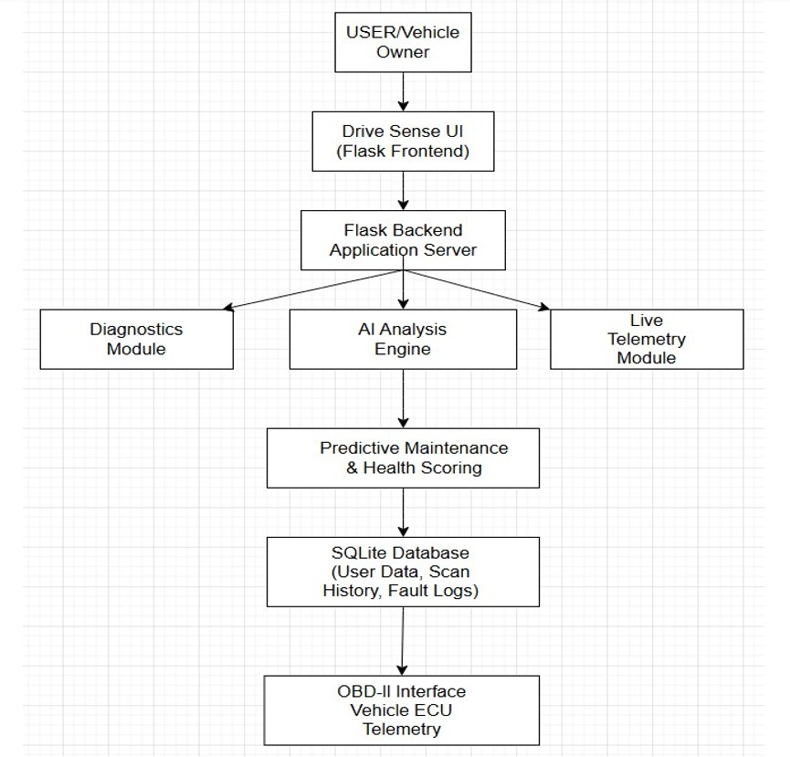

<div align="center">

# 🚗 DriveSense AI

**AI-powered vehicle diagnostics and predictive maintenance platform**

[](https://www.python.org/)
[](https://flask.palletsprojects.com/)
[](https://www.sqlite.org/)
[](https://ollama.com/)
[](LICENSE)

DriveSense AI transforms raw OBD-II telemetry and fault codes into plain-English explanations and maintenance guidance, using a rule-based diagnostic engine, a predictive ML model, and a conversational AI assistant.

Final Year BSc Software Engineering project — Bournemouth University, 2026.

</div>

---

## 📸 Screenshots

| Dashboard | Diagnostics Overview |
|---|---|
|  |  |

| AI Fault Explanation | Live Telemetry |
|---|---|
|  |  |

| Predictive AI / Vehicle Health |
|---|
|  |

> More screenshots (UML, activity diagrams, system diagrams) are included in `DriveSenseAiScreenshots.zip`.

---

## Overview

Modern vehicles generate large volumes of telemetry and diagnostic data through sensors, ECUs, and onboard systems, but the tools used to read that data are built for technicians, not drivers. Fault codes come back as opaque strings like `P0301`, with no context on severity, cause, or urgency.

**DriveSense AI** bridges that gap. It reads live OBD-II data and diagnostic trouble codes, scores them with a rule-based severity engine and a machine learning risk model, and explains what's actually going on in language a non-technical driver can act on — while still giving technicians the underlying data.

## ✨ Key Features

- 🔌 **OBD-II diagnostics** — reads live vehicle data and diagnostic trouble codes (DTCs)
- 📡 **Live telemetry monitoring** — RPM, speed, coolant temp, engine load, throttle, and fuel, updated in real time
- 🧠 **AI-assisted fault interpretation** — plain-English explanations, likely causes, and recommended fixes per fault code
- ⚙️ **Rule-based diagnostic engine** — severity scoring and safe-to-drive assessment
- 📈 **Predictive maintenance** — ML-based component risk forecasting (e.g. engine oil degradation) with explainable, weighted evidence
- 💬 **Conversational AI assistant** — ask natural-language questions about vehicle health
- 🖼️ **Image-based diagnostics** — upload a photo of a component and get an AI visual inspection via LLaVA
- 🗂️ **Service history tracking** — log and review past maintenance
- 📄 **PDF report generation** — export diagnostic scans and health summaries

## 🛠️ Technology Stack

| Layer | Technologies |
|---|---|
| **Backend** | Python, Flask, Flask-SQLAlchemy, Flask-Login, SQLite |
| **AI / ML** | scikit-learn (predictive risk model), Ollama (LLaVA + Mistral), OpenAI API, Whisper (speech), rule-based expert system |
| **Vehicle I/O** | `obd` / `pyserial` (OBD-II), ENET interface |
| **Frontend** | HTML5, CSS3, JavaScript |
| **Reporting** | ReportLab (PDF generation) |

## 🏗️ System Architecture



```
User / Vehicle Owner
        │
        ▼
DriveSense UI (Flask Frontend)
        │
        ▼
Flask Backend Application Server
        │
   ┌────┼────────────┐
   ▼    ▼             ▼
Diagnostics  AI Analysis   Live Telemetry
  Module      Engine          Module
              │
              ▼
   Predictive Maintenance
     & Health Scoring
              │
              ▼
   SQLite Database
(User data, scan history, fault logs)
              │
              ▼
  OBD-II Interface / Vehicle ECU Telemetry
```

## 🚀 Getting Started

> ⚠️ The AI image-analysis and voice features (`pywin32`, `comtypes`, `pyttsx3`) in `requirements.txt` are Windows-specific. On macOS/Linux, skip or comment those lines out — the core diagnostics, telemetry, and rule-based/ML features run fine without them.

### Prerequisites
- Python 3.12+
- [Ollama](https://ollama.com) (optional, for local AI features)
- An OBD-II/ENET interface if you want to connect to a real vehicle (the app also supports a simulated/demo data mode)

### Installation

```bash
# 1. Clone the repository
git clone https://github.com/dasheill26/DriveSenseAI.git
cd DriveSenseAI

# 2. Create and activate a virtual environment
python -m venv venv

# Windows
venv\Scripts\activate
# macOS / Linux
source venv/bin/activate

# 3. Install dependencies
pip install -r requirements.txt
```

### Optional: enable local AI features

```bash
# Install Ollama from https://ollama.com, then pull the models used by DriveSense AI:
ollama pull llava
ollama pull mistral
```

### Run the app

```bash
python run.py
```

The Flask server starts at **http://127.0.0.1:5000**.

## 📖 How to Use

1. **Register / log in** to reach the DriveSense AI dashboard.
2. **Connect a vehicle** via the Connect page (ENET/OBD-II interface), or use demo mode.
3. **View the live dashboard** — telemetry, ML health score, active faults, and prediction confidence at a glance.
4. **Run a diagnostic scan** to pull DTCs from the ECU.
5. **Open AI Explain** on any fault code for a plain-English breakdown: likely causes, affected system, severity, and recommended fixes.
6. **Check Predictive AI** for component risk forecasts (e.g. "Engine Oil — 91% risk, ~1,500 miles remaining") with the evidence behind the prediction.
7. **Log service records** and **export PDF reports** for any scan or health summary.

## 📁 Project Structure

```
DriveSenseAI/
│
├── app/
│   ├── api/            # Image analysis, speech endpoints
│   ├── data/            # SQLite database
│   ├── ml/               # Predictive model, training data & script
│   ├── services/       # Auth, DTC lookup, OBD, Ollama/OpenAI, health & severity engines
│   ├── routes.py
│   └── __init__.py
│
├── static/               # CSS, JS, images
├── templates/         # Flask/Jinja HTML templates
├── data/                  # DTC reference database
├── requirements.txt
├── run.py                # App entry point
└── README.md
```

## 🧪 Testing Environment

Validated on a real vehicle rather than simulation alone:

- **Vehicle:** BMW 1 Series F20 (2018, 118i M Sport)
- **Interface:** ENET Ethernet-to-OBD diagnostic adapter
- **Scope:** Live telemetry communication and real-world DTC retrieval/validation

## 📄 Project Documentation

The full final-year dissertation, covering requirements analysis, system architecture, rule-based AI design, ML implementation, database design, and evaluation, is included in this repo:

📕 [`Final-Dasheill-Vas-dissertation.pdf`](Final-Dasheill-Vas-dissertation.pdf)

## 🔮 Future Improvements

- Native mobile app deployment
- More advanced ML models for fault prediction
- Cloud-based vehicle analytics
- Expanded predictive maintenance coverage
- Enhanced AI voice assistant
- Broader vehicle manufacturer support

## 👤 Author

**Dasheill Vas**
BSc Software Engineering, Bournemouth University

## 📜 License

Distributed under the MIT License. See [`LICENSE`](LICENSE) for details.
